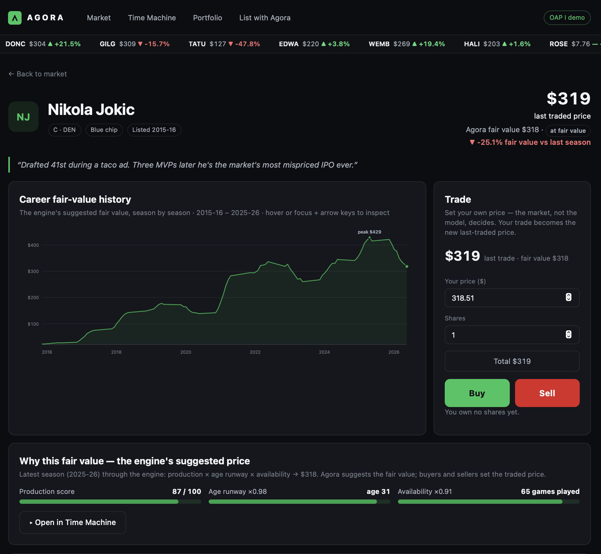
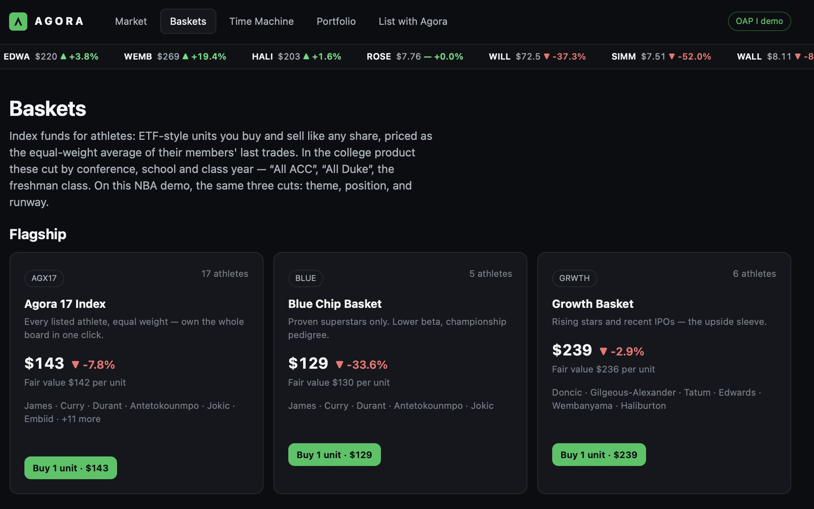

# Agora

**A prototype marketplace where an athlete's brand value is scored, priced and traded like an asset — starting with basketball.**

Built for Stanford's ENGR145 (Technology Entrepreneurship) by an international student team. I am a co-founder and lead of algorithm design: the valuation engine that turns an athlete's production, age and availability into a suggested fair price.

**Live demo:** [mustafa-os.github.io/agora-mvp](https://mustafa-os.github.io/agora-mvp/)

> **This is an educational prototype with simulated trading — not a live, regulated securities exchange.** All prices are model-derived, all dollars are simulated, and nothing here is a security, an offer, or investment advice.



## The idea

Fans can bet on athletes but cannot invest in them. Agora's thesis: let an athlete IPO a minority stake in their brand (the entity that owns their NIL and endorsement income) and give investors a tradable share of that brand's future. A transparent valuation engine suggests a fair price from on-court production, age runway and availability; prices reprice continuously and react to news — draft declarations, injuries, signature games.

## What the MVP implements

The current build (the "OAP II" milestone) is a fully client-side simulation of the product mechanics, focused on high-school, college and G League basketball:

- **Market board** — 23 athletes across three tiers, listed like equities with token symbols, prices, sparklines and a live ticker. College and G League rosters are real players with approximate public season lines; every high-school athlete is **fictional** — no real minor appears on the platform.
- **Agora Score** — each athlete is scored 0–100 on six weighted dimensions: production (30%), availability (20%), recruiting (20%), audience (15%), commercial (10%) and runway (5%). Weights are fixed and published on the in-app Methodology page.
- **Pricing engine** — a replacement-surplus convex curve converts score into a suggested fair value: only score above replacement level earns a price. A deterministic market simulation (low-volatility walk with mean reversion) then generates a season of daily closes plus an intraday series, punctuated by 3–5 labelled news events that gap the price.
- **The engine suggests, the market decides** — your trades set the last-traded price locally, and each athlete shows their premium or discount to fair value.
- **Baskets** — ETF-style multi-athlete units cut by school, class year, position and level (e.g. a Duke basket, the freshman class, a Guards index), priced off members' last trades.
- **Portfolio and ledger** — holdings with average-cost tracking, and every trade appended to a hash-chained settlement ledger (real SHA-256 via WebCrypto, running locally in the browser) with one-click chain verification.
- **Compare and athlete pages** — radar charts across the six dimensions, score breakdowns, season lines, audience/commercial metrics and a price chart with 1D/1W/1M/season ranges.
- **Market Rush** — a 90-second accelerated trading game used in live demos.
- **Safeguards as invariants** — under-18 athletes are analytics-only: no price, no token, no trading. `data/validate_model.py` asserts these rules (alongside board-shape and pricing sanity checks) and any failure blocks shipping.

An earlier build (the "OAP I" milestone, preserved in git history) priced **17 real NBA careers** season by season from public statistics, with a Time Machine that backtested "invest $X in this athlete in that season" against the S&P 500. The screenshots on this page are from that build; the standalone NBA valuation model lives in [nba-player-valuation](https://github.com/Mustafa-OS/nba-player-valuation).

## Screenshots

**Baskets — ETF-style multi-athlete units:**



## How it works

```
data/build_data.py        curated rosters -> Agora Score -> fair value ->
                          deterministic market series -> docs/data/players.js
data/validate_model.py    20-check harness: legal invariants, board shape,
                          pricing sanity (exit 1 on any failure)
docs/                     dependency-free single-page app: vanilla JS,
                          hand-rolled SVG charts, hosted on GitHub Pages
docs/overlay.html         chroma-key broadcast overlay used in the demo video
```

There are no third-party dependencies anywhere: the pipeline is Python 3 standard library, and the app is plain HTML/CSS/JS. All state (portfolio, ledger, last trades) lives in `localStorage`.

## Getting started

```bash
python3 data/build_data.py       # rebuild docs/data/players.js (deterministic, no network)
python3 data/validate_model.py   # run the 20 model/safeguard checks
python3 -m http.server -d docs 8000   # then open http://localhost:8000
```

## Project context

Team venture project for ENGR145S, Stanford Summer Session 2026, presented at the OAP I and OAP II milestones. Mustafa Suleman — co-founder, lead algorithm design (valuation engine and market simulation).

---

Built by Mustafa Suleman — MEng Design Engineering, Imperial College London · [LinkedIn](https://www.linkedin.com/in/mustafaosuleman/)
